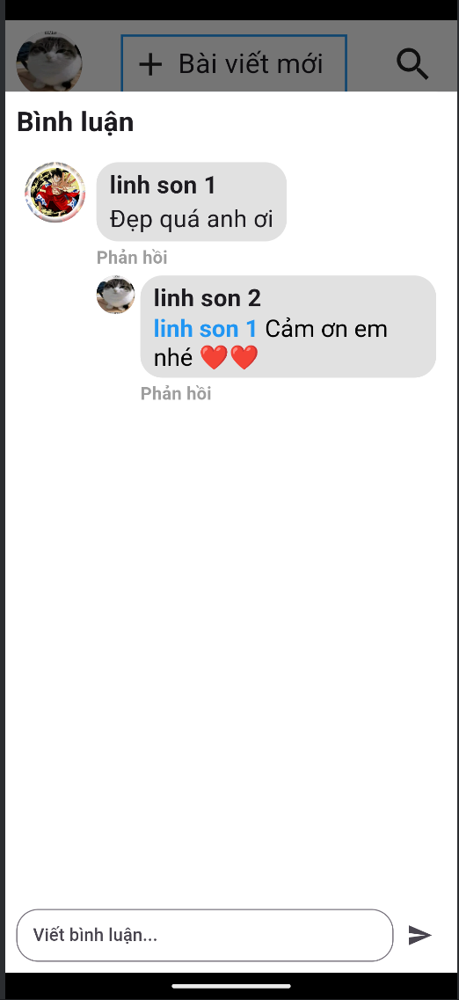
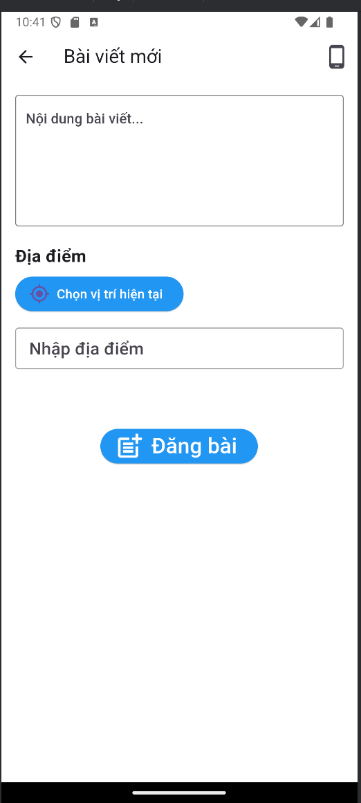

# Snaptrail

Snaptrail là một mạng xã hội giúp người dùng chia sẻ ảnh và địa điểm yêu thích với bạn bè và cộng đồng.

## 📦 Tính năng

- ✅ **Đăng bài**: Người dùng có thể chia sẻ ảnh và mô tả địa điểm.
- ✅ **Bình luận**: Người dùng có thể bình luận vào các bài đăng của bạn bè.
- ✅ **Cài đặt cá nhân**: Người dùng có thể chỉnh sửa thông tin cá nhân và cấu hình quyền riêng tư.

## 🖼️ Demo

  
  
  
  

## 📦 Kiến Trúc Dự Án

- **Frontend**: Sử dụng **Flutter** để tạo giao diện người dùng (UI).
- **Backend**: **Express.js (Node.js)** kết hợp với **MongoDB** cho cơ sở dữ liệu.
- **Tích hợp Goong API**: để chuyển đổi tọa độ GPS sang địa điểm.

## 📝 Hướng Dẫn Sử Dụng

### 1. **Tạo tài khoản**:
   - Nhập email, tên và mật khẩu.
   - Xác nhận tài khoản qua email.

### 2. **Chia sẻ trên mạng xã hội**:
   - Chụp những bức hình đẹp bằng điện thoại.
   - Đăng bài, bình luận và tương tác với bạn bè.
